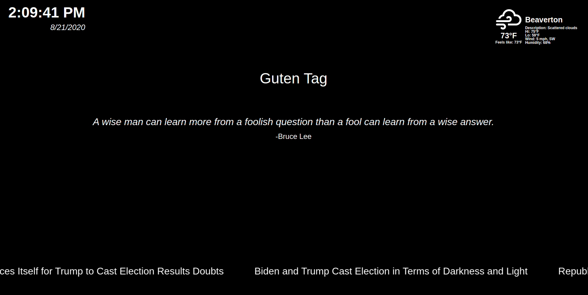

# smart-mirror
A modular smart mirror display application created using node.js for use with a raspberry pi.

This project is an effort to create the informational display portion of a smart mirror application. It consists of a small express based server to display the page locally, one index.html page, and javascript module loaders to load all the remaining necessary packages, stylesheets, and js module files into the html page to be displayed.

Below is a preview of the current build as well as installation instructions:

## Install
- clone repository
- open directory and npm install
- copy the config_sample.js into the config folder as 'config.js'
- change settings and add api keys as necessary
- npm start

## Current Modules
All Modules require four settings.
  * name: name of the module
  * disabled: 'true' for disabled and 'false' for enabled.
  * position: position on screen
  * config: specific module settings

### Weather
- displays local weather using the openWeather API
- can be displayed with current day information or a weekly forcast
- #### Config
  - location: city/state/country
  - type: current/forcast - weather conditions or 5 day forast
  - units: imperial or metric
  - appId: api key for openWeather API

### Date and Time
- simple text display of current date and time
- #### Config
  - none

### Messages
- Displays a greeting for the time of day in multiple languages and displays a quote.
- #### Config
  - appId: Api key for paperquotes API

### news rss
- displays a ticker bar showing the current top stories for the New York Times
- #### Config
  - url: url for the NYT rss feed
  - type: scrolling   \**secondary display type coming soon**

